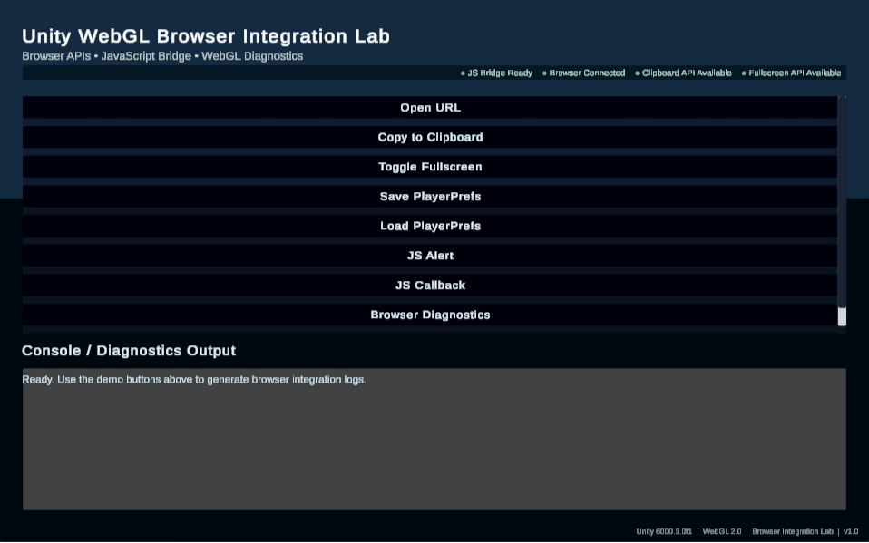
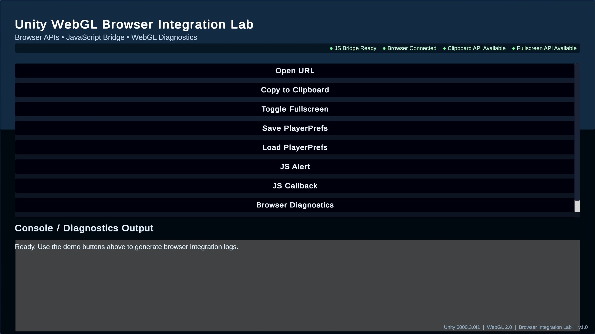
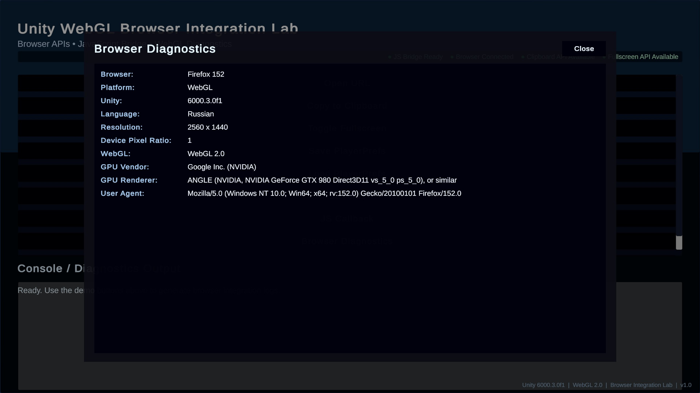
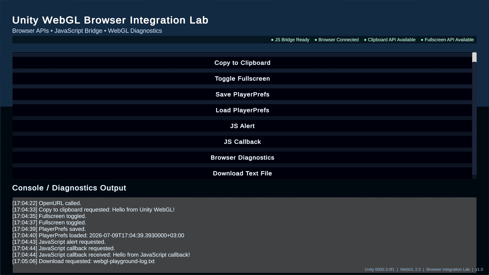

# Unity WebGL Browser Integration Lab

A compact Unity 6.3 WebGL portfolio project focused on practical browser integration from Unity. It demonstrates how a WebGL build talks to JavaScript, uses browser APIs safely, and presents runtime diagnostics in a clean developer-tool interface.



## Live Demo

Coming soon (GitHub Pages)

## Features

- Unity <-> JavaScript Bridge
- Clipboard API
- Fullscreen API
- Browser Diagnostics
- Runtime Status Indicators
- PlayerPrefs
- Download File
- Responsive UI
- WebGL Interview Notes

## Tech Stack

- Unity 6.3 LTS
- C#
- WebGL 2.0
- JavaScript (.jslib)
- Browser APIs
- TextMeshPro
- Unity UI

## Screenshots

### Home Screen



### Browser Diagnostics



### Runtime Console



## Project Structure

- `Assets/_Project/Scenes/` - main WebGL playground scene.
- `Assets/_Project/Scripts/Core/` - shared project-level code.
- `Assets/_Project/Scripts/DemoModules/` - small browser integration demo modules.
- `Assets/_Project/Scripts/UI/` - runtime UI, status, logger, and diagnostics presentation.
- `Assets/_Project/Scripts/WebGL/` - C# WebGL bridge wrappers.
- `Assets/Plugins/WebGL/` - Unity WebGL `.jslib` plugin functions.
- `docs/` - interview notes and release images.

## Why This Project Exists

This laboratory was created to:

- learn Unity WebGL deeply;
- demonstrate practical browser integration techniques;
- serve as a reusable reference project for future WebGL work.

## Current Release

| Item | Value |
|------|-------|
| Version | v1.0 |
| Status | Stable |
| Unity | 6.3 LTS |
| Platform | WebGL 2.0 |

Release notes: see [CHANGELOG.md](CHANGELOG.md).

## How To Build And Run

1. Open the project in Unity 6.3 LTS.
2. Open `Assets/_Project/Scenes/WebGLPlayground.unity`.
3. Switch the build target to WebGL.
4. Build the project.
5. Run the build from a local web server, not directly from `file://`.

Unity's Build And Run option is usually the fastest way to test locally. For an existing build folder, use any simple static server from the build output directory.

## WebGL Build Notes

Unity WebGL builds often use Brotli (`.br`) or Gzip (`.gz`) compression. Local and production servers must send the correct `Content-Encoding` headers for compressed files:

- `.br` files need `Content-Encoding: br`.
- `.gz` files need `Content-Encoding: gzip`.
- WebAssembly files should use `Content-Type: application/wasm`.

If those headers are missing, the browser may fail to load the build even when the files are present.

## Roadmap

### v1.1

- File Upload
- Drag & Drop
- Browser Local Storage

### v1.2

- IndexedDB
- Browser Notifications
- Clipboard Images

### v2.0

- Complete Browser API Laboratory
- Production-grade architecture
- Interactive Browser API catalog

## Suggested GitHub Topics

```text
unity
unity3d
webgl
javascript
browser-api
csharp
gamedev
portfolio
wasm
```

## License

MIT License
